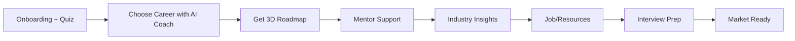

# 🎯🎓 Clarioo - One Stop Career Platform

> **Clarity today, Success follows tomorrow**

[](https://www.youtube.com/watch?v=zAU65GELeRU)
[](-)

An AI-powered career guidance platform that helps students navigate their career journey from confusion to clarity. Built by **Team ROX** for Build with Gemini .

<div align="center">
  
[](https://www.youtube.com/watch?v=zAU65GELeRU)

  <div align="center"> 
  
  <div align="left">

## 🚀 Problem Statement

Today, **10.4%** of Indian students receive formal career guidance, while most youth report career confusion due to unclear paths and generic advice _(Bharat Career Aspirations Report 2025 by UNICEF)_.

Students face four critical challenges:

- **🤔 Career Confusion**: Lost choosing careers that fit their skills and passions
- **📚 Lack of Awareness**: Limited knowledge of real opportunities, colleges, and courses
- **🤝 Limited Guidance & Network**: Missing mentors and strong professional networks
- **💡 Interest-Driven Gap**: Careers fail when choices aren't aligned with personal interests

---

## 💡 Our Solution

**Clarioo** is an AI-powered platform that guides students with clear career roadmaps and essential tools, aligning with:

- **UN SDG 4**: Quality Education
- **UN SDG 8**: Decent Work & Economic Growth

From a personalized platform to career guidance to making them job ready
everything in one platform !

It all starts with quiz ! - to mentor connect (industry experts) - to personalised roadmaps --- to jobs/courses -- to interview prep making them market ready !

### Core Features

#### 1. 🤖 AI Career Coach & Voice Assistants

- Personalized career guidance powered by **Google Gemini 2.5 Flash**
- Real-time conversational AI with database read/write access
- Voice-enabled assistance for seamless interaction

#### 2. 🗺️ 3D AI Roadmaps

- Interactive drag-and-drop customizable roadmaps
- Curated learning resources at every step
- Visual progress tracking

#### 3. 👨‍🏫 Mentor Connect & Peer Network

- 1:1 video calls with industry experts (WebRTC)
- Real-time peer messaging
- Expert guidance for real-world insights

#### 4. 🎯 Career Explorer

- Discover nearby colleges with placement data
- Personalized quiz for career recommendations
- Latest job listings and course recommendations

#### 5. 🎤 AI Interview Preparation

- AI-powered mock interviews
- Resume builder and analyzer
- Market-ready preparation tools

#### 6. 📊 Industry Insights & Resources

- Real-time web scraping for latest opportunities
- Course certifications tracking
- Google Calendar sync for task management

---

## 🏗️ Tech Stack

### Frontend

- **Next.js** - React framework
- **TypeScript** - Type safety
- **Tailwind CSS** - Styling
- **Shadcn UI** - Component library
- **Framer Motion** - Animations

### Backend

- **Node.js** - Runtime environment
- **Supabase** - Database & Authentication
- **PostgreSQL** - Primary database
- **Redis/Upstash** - Caching layer

### AI & Machine Learning

- **Google Gemini 2.5 Flash** - Primary AI model
- **LangChain** - AI orchestration
- **Groq** - Fast inference
- **Pinecone** - Vector database
- **Hugging Face** - NLP models
- **Tavily/SerpAPI** - Web scraping

### APIs & Services

- **Google API** - Calendar integration
- **Discord API** - Community features
- **Slack API** - Notifications
- **Tavily** - Web search
- **SerpAPI** - Search data
- **ImageKit.io** - Image optimization

### Real-time Features

- **WebRTC** - Video calling
- **Socket.io** - Real-time messaging
- **Stream** - Chat infrastructure

### Deployment & Tools

- **Vercel** - Hosting platform
- **GitHub** - Version control
- **Postman** - API testing

---

## 🎨 Key Highlights

### Why Clarioo is Different

Unlike other platforms that provide isolated solutions, Clarioo offers:

✅ **Complete Career Ecosystem** - Everything in one place  
✅ **AI-Powered Personalization** - Dynamic, up-to-date advice  
✅ **Real-World Networking** - Connect with mentors and peers  
✅ **Interactive Learning** - 3D roadmaps with curated resources  
✅ **Market-Ready Tools** - Interview prep, resume building, job tracking

### Competitive Advantage

- **20%** less monthly charges than existing platforms
- **30%** increase in college adoption
- **90%** usefulness rating from early users

---

## 📈 Impact & Benefits

### Social Impact

| Impact Area                 | Description                                                        |
| --------------------------- | ------------------------------------------------------------------ |
| 🎯 **Reduce Confusion**     | Help students discover careers matching their interests and skills |
| 📚 **Avoid Dropouts**       | Guide 10th-12th students early, keeping them motivated             |
| 💼 **Boost Employability**  | Equip students with right skills, courses, and mentorship          |
| 🌐 **Increase Awareness**   | Provide real-time insights on careers and opportunities            |
| 🌍 **Bridge Education Gap** | Promote equal access to quality guidance for all learners          |

### Target Goals

- Reduce career confusion for **10L+ students** in Tier-2/3 cities by 2026
- Partner with **100+ schools/mentors** in 12 months
- Increase employability through personalized skilling

---

## 💰 Business Model

### Freemium Model

- **Free Credits**: 100 credits on sign-up + referral credits
- **Freemium Model**: User can have access to mentor connect, ai tools for free and some premium tools need subscription
- **Referral Bonus**: User will also get bonus on inviting their friends to this platform
- **Pro Subscription**: User can buy 899/ month subscription to have access to our advance modals and Features
- **Credit System**: Purchase additional credits as needed

### Revenue Streams

| Stream               | Type | Scalability |
| -------------------- | ---- | ----------- |
| Credit Packs         | B2C  | High        |
| Pro Subscription     | B2C  | Medium      |
| Mentor Commission    | B2C  | Medium      |
| College Partnerships | B2B  | High        |

### Market Opportunity

- India's EdTech market: **$7.5B** (2024) → **$29B** (2030)
- Global career counselling market: **$2.67B** (2023) → **$4.55B** (2031)
- **93%** of Indian students aware of only ~7 career options despite hundreds available

---

## 🚀 Getting Started

### Installation

1. **Clone the repository**

```bash
git clone https://github.com/ritesh-sinha29/clario-Ai-powered-career-platform
cd clario-Ai-powered-career-platform
```

2. **Install dependencies**

```bash
pnpm install
```

3. **Set up environment variables**

```bash
cp .env.example .env.local
```

Add your API keys:

```env
# Google Gemini
GEMINI_API_KEY=your_gemini_key

# Supabase
NEXT_PUBLIC_SUPABASE_URL=your_supabase_url
NEXT_PUBLIC_SUPABASE_ANON_KEY=your_supabase_key

# Other APIs
TAVILY_API_KEY=your_tavily_key
SERPAPI_KEY=your_serpapi_key
# ... add other keys
```

4. **Run the development server**

```bash
pnpm install
pnpm dev
```

Open [http://localhost:3000](http://localhost:3000) in your browser.

### Build for Production

```bash
pnpm build
pnpm start
```

---

## 📱 User Journey



---

## 🎯 Roadmap

### Phase 1 (Completed)

- ✅ MVP Development
- ✅ AI Career Coach with Gemini integration
- ✅ 3D Roadmap builder
- ✅ Mentor connect system
- ✅ Web and mobile versions

### Phase 2 (Current - 30-90 Days)

- 🔄 User experience refinement
- 🔄 Partnership with colleges and Mentors
- 🔄 Expand to 10th-grade students
- 🔄 Enhanced personalization features

### Phase 3 (Future)

- 📅 College partnerships expansion
- 📅 EdTech platform integrations
- 📅 Multilingual support
- 📅 Global rollout

---

## 👥 Team ROX

| Name              | Role                       | College                                   |
| ----------------- | -------------------------- | ----------------------------------------- |
| **Ronit Rai**     | Team Leader                | LPU (CSE 2nd Year)                        |
| **Ritesh Sinha**  | FullStack Dev & Researcher | SSAIET, Navsari (CSE 2nd Year)            |
| **Riya**          | UI/UX & R&D                | LPU (CSE 2nd Year)                        |
| **Harsh**         | Developer                  | LPU (CSE 2nd Year)                        |
| **Ayushi Rajput** | Fullstack Developer        | Tula's Institute, Dehradun (CSE 2nd Year) |

---

## 📊 Architecture

```
┌─────────────────┐
│   Next.js App   │
└────────┬────────┘
         │
    ┌────┴────┐
    │         │
┌───▼──┐  ┌──▼────┐
│ AI   │  │ APIs  │
│ Layer│  │ Layer │
└───┬──┘  └──┬────┘
    │        │
    └────┬───┘
         │
    ┌────▼────────┐
    │  Supabase   │
    │  PostgreSQL │
    └─────────────┘
```

---

## 🤝 Contributing

We welcome contributions! Please follow these steps:

1. Fork the repository
2. Create a feature branch (`git checkout -b feature/AmazingFeature`)
3. Commit your changes (`git commit -m 'Add some AmazingFeature'`)
4. Push to the branch (`git push origin feature/AmazingFeature`)
5. Open a Pull Request

---

## 📄 License

This project is licensed under the MIT License - see the [LICENSE](LICENSE) file for details.

---

## 📞 Contact & Support

- **Website**: developing
- **Demo Video**: [Watch on YouTube](link)
- **Email**: Contact team leader Ronit Rai

---

## 🙏 Acknowledgments

- Google Gemini for AI capabilities
- UNICEF for research data

---

<div align="center">

**Made with ❤️ by Team ROX**

_Transforming career confusion into clarity_

[](https://github.com/ritesh-sinha29/clario-ai-powered-career-platform)

</div>
